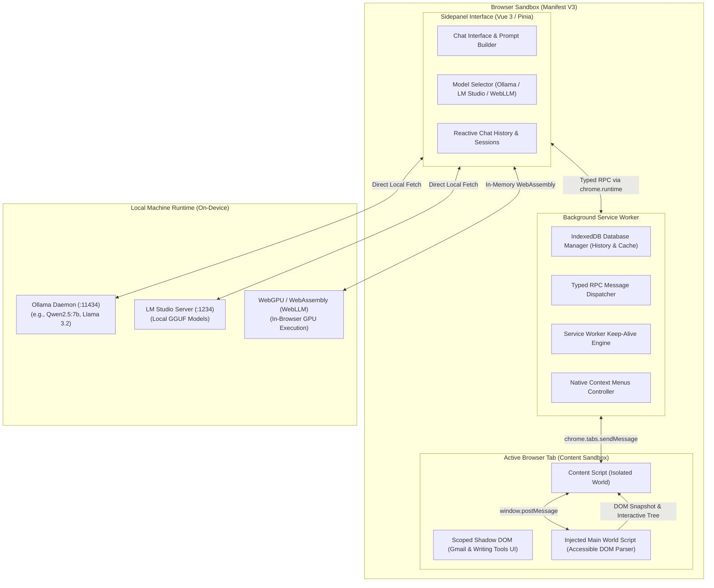
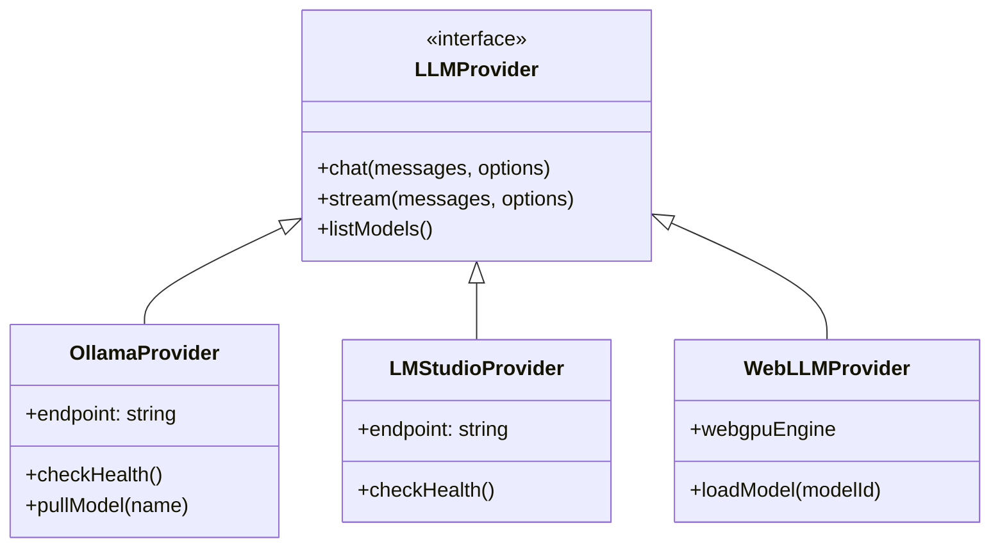
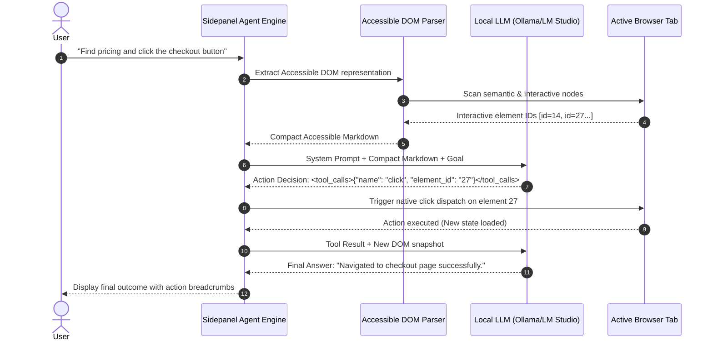
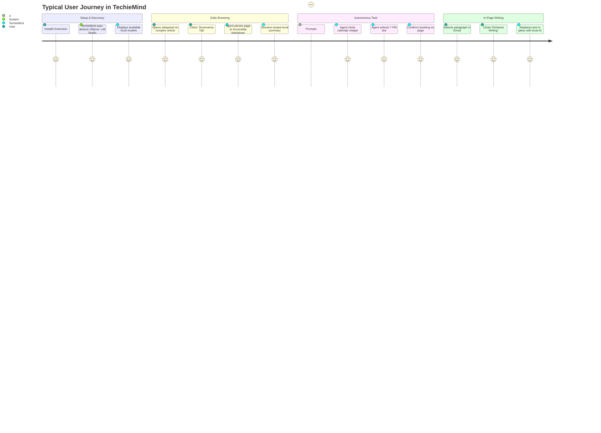

<!-- Repository: https://github.com/Vikhyath-thelazycoder/TechieMind-On-device-browser-agent -->

# 🧠 TechieMind: Architectural & Technical Master Blueprint
> **The Definitive Guide to TechieMind — An Autonomous, Private, On-Device Browser AI Agent**

[](https://github.com/Vikhyath-thelazycoder/TechieMind-On-device-browser-agent)
[](LICENSE)
[-green.svg)](https://wxt.dev)
[]()

---

## 📑 Table of Contents
1. [Executive Summary](#-executive-summary)
2. [Why TechieMind? (The Core Philosophy)](#-why-techiemind-the-core-philosophy)
3. [System Architecture & Topology](#-system-architecture--topology)
4. [How TechieMind Works: The Core Engines](#-how-techiemind-works-the-core-engines)
   - [A. On-Device LLM Runtime Layer](#a-on-device-llm-runtime-layer)
   - [B. The Autonomous Agent & Tool Execution Loop](#b-the-autonomous-agent--tool-execution-loop)
   - [C. Accessible Markdown DOM Parser](#c-accessible-markdown-dom-parser)
   - [D. In-Page Copilot & DOM Injection (Gmail & Writing Tools)](#d-in-page-copilot--dom-injection-gmail--writing-tools)
   - [E. Typed RPC & Multi-World Messaging Engine](#e-typed-rpc--multi-world-messaging-engine)
   - [F. Storage, Cache & IndexedDB Layer](#f-storage-cache--indexeddb-layer)
5. [User Interaction Lifecycle (How Users Experience TechieMind)](#-user-interaction-lifecycle)
6. [How an AI Understands TechieMind (Agent Mental Model)](#-how-an-ai-understands-techiemind)
7. [Comprehensive Codebase Structure & File Guide](#-comprehensive-codebase-structure--file-guide)
8. [Architectural Assessment & Strategic Opinion](#-architectural-assessment--strategic-opinion)

---

## 🚀 Executive Summary

**TechieMind** is an open-source, fully private, on-device autonomous AI agent and web browser extension built for Chromium and Firefox.

Unlike traditional AI extensions that forward web content, user prompts, and private tokens to cloud APIs (OpenAI, Anthropic, Google), **TechieMind runs 100% locally** on the user’s device by integrating directly with:
1. **Ollama** (via local REST endpoints at `http://localhost:11434`)
2. **LM Studio** (via local endpoints at `http://localhost:1234/v1`)
3. **WebLLM** (running models directly inside the browser using WebGPU and WebAssembly)

TechieMind allows users to chat with active browser tabs, autonomously navigate and click interactive page elements, execute multi-step web research workflows, translate and summarize full articles, parse local PDFs, and generate contextual email replies in Gmail — **with zero bytes leaving the local machine**.

---

## 🛡️ Why TechieMind? (The Core Philosophy)

| Dimension | Traditional Cloud Extensions | TechieMind On-Device Agent |
| :--- | :--- | :--- |
| **Privacy & Security** | Browser DOM, text, session tokens, and emails are uploaded to 3rd-party servers. | **Absolute Zero Leakage**: Everything executes in localhost RAM / GPU. |
| **Operational Cost** | Requires recurring monthly subscriptions or pay-per-token API keys. | **Free Forever**: Powered by open-weights models (Qwen 2.5, Llama 3, DeepSeek, Gemma). |
| **Offline Resilience** | Stops functioning if internet drops or API servers experience downtime. | **Fully Functional Offline**: Runs seamlessly offline or in air-gapped setups. |
| **Browser Control** | Passive text overlay. | **Active Autonomous Agent**: Can parse interactive elements, click buttons, switch tabs, and summarize. |
| **Latency & Throttling** | Subject to cloud rate limits, queueing, and network latency. | **Sub-second Local Token Streaming** directly from local GPU/NPU. |

---

## 🏗️ System Architecture & Topology

TechieMind is developed using the modern **WXT framework** (Vite + Vue 3 + TypeScript) following Chrome Manifest V3 (MV3) specifications while maintaining Firefox multi-browser parity.



### Key Architectural Boundaries:
1. **Sidepanel (`entrypoints/sidepanel/`)**: The control hub where the conversation unfolds, agent thoughts stream, and task cards render.
2. **Background Worker (`entrypoints/background/`)**: Manages lifecycle, IndexedDB cache, cross-tab events, and keeps MV3 active during long generation streams.
3. **Content Script (`entrypoints/content/`)**: Injected into web pages with isolated Shadow DOM containers to avoid styling collisions with host websites.
4. **Main World Injector (`entrypoints/main-world-injected/`)**: Runs directly inside the website's execution context to extract accurate accessible DOM trees, bypass framework abstraction layers, and trigger native click actions.

---

## ⚙️ How TechieMind Works: The Core Engines

### A. On-Device LLM Runtime Layer

TechieMind features an extensible provider abstraction located in [`utils/llm/`](file:///Users/vikhyathmgowda007/Developer/techimind/utils/llm/):



1. **Ollama Integration (`utils/llm/providers/ollama/`)**:
   - Queries `http://localhost:11434/api/tags` to discover locally downloaded models.
   - Detects context length, GPU offloading, and streaming NDJSON chunks via native `fetch()`.
   - Supports tool calling using custom grammar formatters when using models that lack native function-calling formats.
2. **LM Studio Integration (`utils/llm/providers/lm-studio/`)**:
   - Interfaces with OpenAI-compatible endpoints (`/v1/chat/completions`).
   - Supports advanced reasoning parameters (e.g. DeepSeek R1 reasoning effort, thought chunk extraction).
3. **WebLLM (`utils/llm/web-llm.ts`)**:
   - Provides zero-install fallback using `@mlc-ai/web-llm`. Runs lightweight models (e.g., SmolLM, Llama-3.2-1B, Qwen2.5-0.5B) directly in the browser tab using WebGPU shaders.

---

### B. The Autonomous Agent & Tool Execution Loop

When a user gives TechieMind an autonomous task (e.g., *"Find the cheapest flight on this page and summarize its conditions"*), the agent initiates a recursive Tool-Use Loop:



#### Supported Agent Tools:
- **`view_tab`**: Captures active tab DOM rendered as semantic Accessible Markdown.
- **`click`**: Simulates trusted user clicks on any element via generated integer element IDs.
- **`search_online`**: Performs local autonomous web search without third-party API dependencies.
- **`fetch_page`**: Retrieves full text and metadata of any URL.
- **`view_pdf`**: Decodes client-side binary PDFs into text chunks using `pdfjs-dist`.
- **`view_image`**: Encodes active viewport or uploaded images into Base64 for multimodal vision models.

---

### C. Accessible Markdown DOM Parser
*Located in [`entrypoints/inject-utils/document-parser.ts`](file:///Users/vikhyathmgowda007/Developer/techimind/entrypoints/inject-utils/document-parser.ts)*

A major challenge with browser agents is that raw HTML consumes thousands of LLM tokens and overflows context windows. TechieMind solves this through **Accessible Markdown**:
1. Strips all styles, scripts, SVGs, base64 blobs, invisible tracking pixels, and empty nodes.
2. Identifies all interactive elements (`<a>`, `<button>`, `<input>`, `<select>`, elements with `cursor: pointer` or ARIA roles).
3. Assigns a tiny integer identifier attribute (`data-nativemind-parser-internal-id="12"`).
4. Emits a concise, token-efficient Markdown representation:
   ```markdown
   # Welcome to Pricing Page
   Choose your plan:
   - [Starter Plan ($10/mo)] <button id="12">Select Starter</button>
   - [Pro Plan ($25/mo)] <button id="13">Select Pro</button>
   ```
5. The local model only has to output `{"element_id": "13"}` to trigger a real interaction!

---

### D. In-Page Copilot & DOM Injection (Gmail & Writing Tools)
*Located in [`entrypoints/content/`](file:///Users/vikhyathmgowda007/Developer/techimind/entrypoints/content/)*

TechieMind doesn't just stay confined to the sidepanel. It intelligently augments target websites:
- **Gmail AI Assistant**: Detects Gmail thread views, injects native-looking buttons into Gmail action bars, and provides instant **Summarize Thread**, **One-Click Professional Reply**, and **Draft Generator** directly inside the compose window.
- **Writing Tools**: When users select text on any website, TechieMind displays a non-intrusive floating pill offering instant Fix Grammar, Simplify, Translate, or Expand.
- **Style Isolation**: All injected UI components use closed **Shadow DOM** structures with custom CSS resets, guaranteeing zero layout breakages on host sites.

---

### E. Typed RPC & Multi-World Messaging Engine
*Located in [`utils/rpc/`](file:///Users/vikhyathmgowda007/Developer/techimind/utils/rpc/)*

Chrome extensions are separated into multiple sandboxes (Background Worker, Sidepanel UI, Content Script, Main World). TechieMind implements a **strongly typed end-to-end RPC layer**:
- `sidepanel-fns.ts`: Functions callable by background from sidepanel.
- `background-fns.ts`: Central database, settings, and lifecycle methods called from sidepanel.
- `content-fns.ts`: DOM querying, screenshot capturing, and element scrolling invoked by the agent.
- `content-main-world-fns.ts`: Execution of code directly inside the host site's JavaScript context.

Every RPC method is type-checked at compile time, eliminating runtime string message mismatch errors.

---

### F. Storage, Cache & IndexedDB Layer
*Located in [`entrypoints/background/services/`](file:///Users/vikhyathmgowda007/Developer/techimind/entrypoints/background/services/)*

- **IndexedDB (`TechieMindExtension`)**: Stores chat history, multi-turn messages, tool calls, and large PDF attachments across sessions.
- **Centralized Translation Cache**: Implements an LRU + IndexedDB cache that automatically preserves translations of previously visited web pages for 30 days, avoiding re-querying the local LLM for identical content.
- **Reactive User Configuration (`utils/user-config/`)**: Stores prompts, active model names, shortcuts, and themes using Chrome's synchronized `storage.local` layer wrapped in Vue reactive proxies.

---

## 👤 User Interaction Lifecycle



---

## 🤖 How an AI Understands TechieMind

If an AI agent or language model is tasked with working on, extending, or maintaining this codebase, here is the essential mental model:

### 1. Framework Identity
- This is a **WXT** project. WXT is an open-source, Vite-based framework for browser extensions.
- Entry points live under `entrypoints/`. WXT automatically compiles each directory into the appropriate extension manifest configuration (`manifest.json` is generated at build time).
- Vue 3 Single-File Components (`.vue`) using `<script setup lang="ts">` and Tailwind CSS are used for all UIs.

### 2. State & Reactivity
- UI state is managed via **Pinia** and Vue's `reactive()` / `ref()`.
- Global extension storage is wrapped with WXT's `storage.defineItem` located in [`utils/storage.ts`](file:///Users/vikhyathmgowda007/Developer/techimind/utils/storage.ts).

### 3. Model Communication Protocol
- All prompts are defined using the `definePrompt()` helper in [`utils/prompts/`](file:///Users/vikhyathmgowda007/Developer/techimind/utils/prompts/).
- System prompts are internationalized and dynamically adjust based on active tools and target languages.
- When adding new tools, register them in `utils/llm/tools/prompt-based/tools.ts`.

### 4. Build & Verification Commands
- **Dev mode**: `pnpm dev` (launches Chromium with hot module reloading).
- **Compile check**: `pnpm compile` (`vue-tsc --noEmit`).
- **Lint**: `pnpm run lint` (`eslint`).
- **Unit Tests**: `pnpm test:unit` (`vitest run`).
- **End-to-End Tests**: `pnpm test:e2e` (`playwright`).

---

## 📂 Comprehensive Codebase Structure & File Guide

```
techimind/
├── .github/                      # GitHub Actions CI/CD workflows, templates & CODEOWNERS
│   ├── workflows/                # Automated linting, testing, and release pipelines
│   └── ISSUE_TEMPLATE/           # Bug report and feature request templates
├── assets/                       # Static branding assets and UI icons
│   └── icons/                    # SVG vector icons for UI buttons
├── components/                   # Reusable Vue 3 UI component library
│   ├── AutoExpandTextArea.vue    # Adaptive prompt input with auto-height adjustment
│   ├── MarkdownViewer.vue        # Syntax-highlighted, streaming markdown renderer
│   ├── Modal.vue                 # Accessible modal dialogs
│   ├── ModelSelector.vue         # Dropdown selector for local LLMs
│   └── ...                       # Selector, Switch, ToastGroup, RootProvider
├── composables/                  # Shared Vue 3 composition functions
│   ├── useConfirm.tsx            # Programmatic confirmation modal dialogs
│   ├── useI18n.ts                # Reactive internationalization helper
│   ├── useLLM.ts                 # Reactive hook to stream and generate from active LLM
│   └── useScrollToBottom.ts      # Smooth auto-scrolling for streaming chat
├── entrypoints/                  # Primary Extension Endpoints (Manifest V3)
│   ├── background/               # Background Service Worker
│   │   ├── database/             # IndexedDB schemas & upgrade migrations
│   │   ├── services/             # CacheService, HistoryService, DatabaseManager
│   │   └── index.ts              # Service worker bootstrap & keepalive loop
│   ├── content/                  # Content Scripts injected into web pages
│   │   ├── components/           # GmailTools and WritingTools Vue components
│   │   ├── utils/                # Page injection logic & DOM helpers
│   │   └── index.tsx             # Content script bootstrap & style attachment
│   ├── inject-utils/             # Injected DOM utilities (Document Parser & Helpers)
│   ├── main-world-injected/      # Scripts executing directly in the website main-world
│   ├── popup/                    # Fast popup window shown on toolbar icon click
│   ├── settings/                 # Full-screen options and configuration dashboard
│   └── sidepanel/                # Core Chrome Sidepanel AI Chat Interface
│       ├── components/           # Chat history, tool call cards, onboarding cards
│       ├── utils/                # Chat state manager, agent runner, translation task
│       └── main.tsx              # Sidepanel Vue app initialization
├── locales/                      # 12 Language JSON translation catalogs (en, es, fr, de, etc.)
├── modules/                      # Custom WXT build plugins
│   ├── auto-icons/               # Generates all icon sizes from assets/icon.png
│   └── define-app-metadata/      # Injects build timestamps and version metadata
├── public/                       # Static public assets (fonts, web-accessible resources)
│   └── fonts/                    # Bundled Inter and InterDisplay woff2 fonts
├── styles/                       # Global Tailwind CSS and typography stylesheets
├── types/                        # TypeScript domain types (chat, browser, reasoning, tab)
├── utils/                        # Core Utility Libraries & Algorithms
│   ├── document-parser/          # HTML to Accessible Markdown conversion engine
│   ├── i18n/                     # Internationalization runtime & detector
│   ├── llm/                      # Ollama, LM Studio, WebLLM providers & middlewares
│   ├── prompts/                  # System prompts, agent rules, and tool prompt builders
│   ├── rpc/                      # Strongly typed multi-world RPC system
│   ├── translation-cache/        # IndexedDB persistent translation caching layer
│   ├── user-config/              # Reactive user preferences and custom system prompts
│   ├── constants.ts              # Global URLs, branding strings, and layout constants
│   └── logger.ts                 # Namespaced logger ([TechieMind])
├── package.json                  # Dependencies, scripts, and extension metadata
├── README.md                     # Public repository documentation
├── LICENSE                       # MIT Open Source License
└── wxt.config.ts                 # WXT build system and manifest configuration
```

---

## 🎯 Architectural Assessment & Strategic Opinion

### ⭐ Strengths & Competitive Edges

1. **True Privacy Architecture**:
   Most "private" AI plugins simply use client-side API keys that still send confidential data to cloud data centers. TechieMind is truly private — if a user disconnects their Wi-Fi, the extension continues to function normally using local models.
2. **Accessible Markdown is a Game Changer**:
   Compressing HTML trees into semantic Markdown with numeric action identifiers drastically decreases token usage. This allows standard 7B/8B models (e.g. `llama3.1:8b`, `qwen2.5:7b`) to reliably act as web agents without exceeding their prompt window.
3. **Clean Separation of Concerns via WXT & RPC**:
   The multi-process nature of browser extensions often leads to spaghetti code. TechieMind's typed RPC layer cleanly separates background persistence from sidepanel presentation and main-world DOM manipulation.
4. **Resilient Local Multi-Backend Support**:
   Supporting Ollama, LM Studio, and in-browser WebGPU (WebLLM) simultaneously ensures that beginners (zero install WebGPU) and advanced power users (high-speed Ollama/LM Studio GPU servers) are equally served.

### ⚠️ Challenges & Limitations

1. **Hardware Dependency**:
   On-device LLMs require modern hardware. Running 7B+ models smoothly requires an Apple Silicon Mac (M1/M2/M3/M4) or a PC with a dedicated Nvidia/AMD GPU. On lower-end machines with integrated Intel graphics, users must rely on smaller quantized models (1B–3B).
2. **Context Length Constraints**:
   While cloud models offer 128k–1M context windows, local models typically run with 4k–32k context windows due to VRAM limits. TechieMind’s DOM pruning is critical to keep pages within these boundaries.
3. **Manifest V3 Service Worker Lifetimes**:
   Chrome aggressively terminates background workers after 30 seconds of inactivity. TechieMind implements keep-alive heartbeats during streaming responses to prevent mid-turn agent termination.

### 🔮 Recommended Evolution & Roadmap

1. **Native Local Vector Search (RAG)**:
   Integrate a lightweight vector database (e.g., `voy-search` or SQLite-vec via WebAssembly) to enable semantic vector retrieval across the user’s browsing history and saved tabs without uploading data.
2. **Vision-Driven Web Navigation**:
   With the rise of local vision-language models (e.g. `qwen2.5-vl`), TechieMind can evolve from pure DOM parsing to multimodal coordinate clicking, handling complex Canvas and SVG web apps where DOM nodes don't exist.
3. **Model Context Protocol (MCP) Client**:
   Implement local MCP client support to allow TechieMind to connect to other local developer tools, databases, and local file systems directly from the sidepanel.

---

*Authored for **TechieMind** — Private, on-device AI assistant & autonomous browser agent.*  
*Repository: [https://github.com/Vikhyath-thelazycoder/TechieMind-On-device-browser-agent](https://github.com/Vikhyath-thelazycoder/TechieMind-On-device-browser-agent)*
